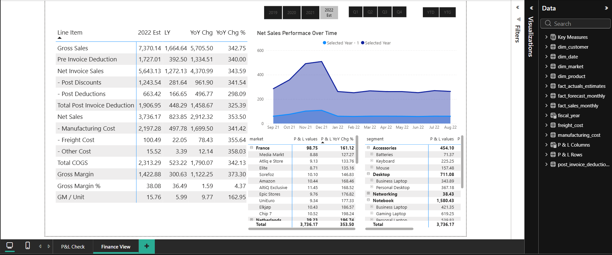

# Finance Analytics Report - Power BI

## 📊 Project Overview
This project involves a comprehensive Finance View dashboard built in Power BI, designed to provide stakeholders with deep insights into financial performance, including P&L statements, Net Sales trends, and regional performance.

## 🚀 Key Features
* **Dynamic P&L Statement:** A detailed breakdown of Gross Sales, COGS, and Gross Margin with Year-over-Year (YoY) comparisons.
* **Performance Over Time:** An area chart visualizing Net Sales trends against Last Year (LY) benchmarks.
* **Market & Segment Analysis:** Comparative tables for performance across different markets (France, Netherlands, etc.) and product segments (Accessories, Desktop, Notebook).
* **Interactive Filters:** Slicers for Fiscal Year, Quarters, and specific YTD/YTG views.

## 🛠️ Technical Skills Demonstrated
* **Data Modeling:** Implementation of a Star Schema with Fact and Dimension tables.
* **DAX (Data Analysis Expressions):** Created complex measures for YoY Growth %, Gross Margin %, and dynamic time intelligence.
* **Data Transformation:** Extensive use of Power Query for data cleaning and ETL.
* **Financial Formatting:** Using "P&L Rows" and "P&L Columns" tables to create a professional financial layout.

## 📈 Dashboard Preview

## 💡 Key Business Insights
* **Gross Margin %:** Currently standing at **38.08%** for the 2022 Est.
* **Highest Performing Segment:** The **Notebook** segment is a major contributor with 1,580.43 in sales.
* **YoY Growth:** Most line items show a significant growth of ~350%, indicating a massive scale-up compared to the previous year.

> **Note:** Due to licensing and data privacy, the source `.pbix` and raw datasets are not included.
